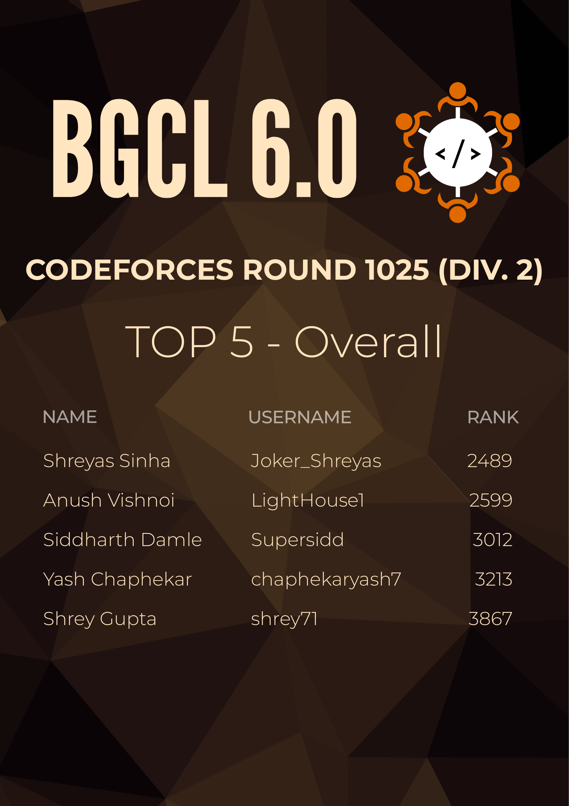

# AlgoInstaAutomated

open [`main.py`](./main.py), and edit this part based on your needs

```py
generator = ContestImageGenerator(
    contestId=2109,
    descText="TOP 5 - Overall",
    imageSelected=1,
    regex=r"^(2023|2024|2022).{9}$",
    overrideContestName=False,
    overrideText="CODEFORCES Div. 2 Round 1025"
)
```

Run it using `python3 main.py`

### Docker
To load the docker image, use `docker load -i algoinsta.tar`, and to run it do `docker run -it -v "$PWD/output:/app/output" algoinsta`

